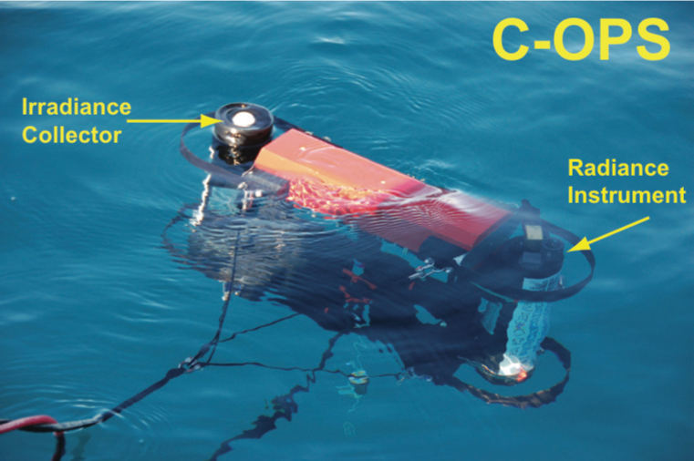
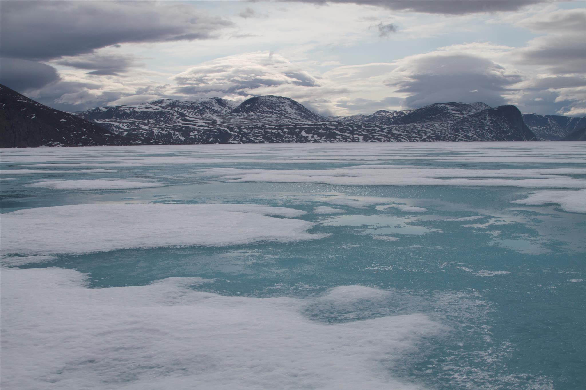
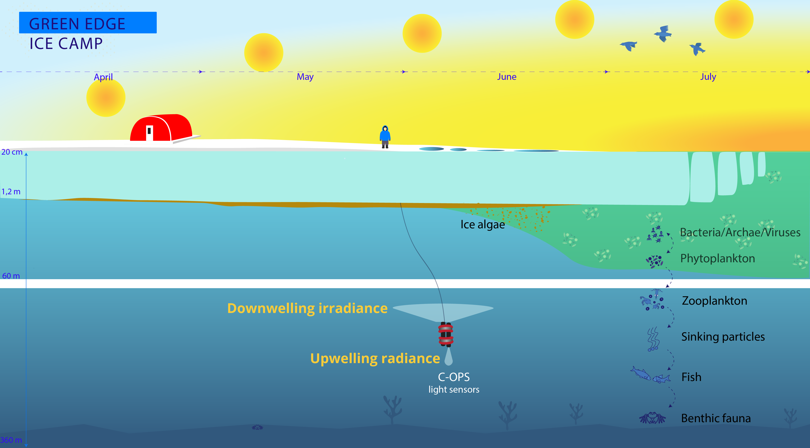
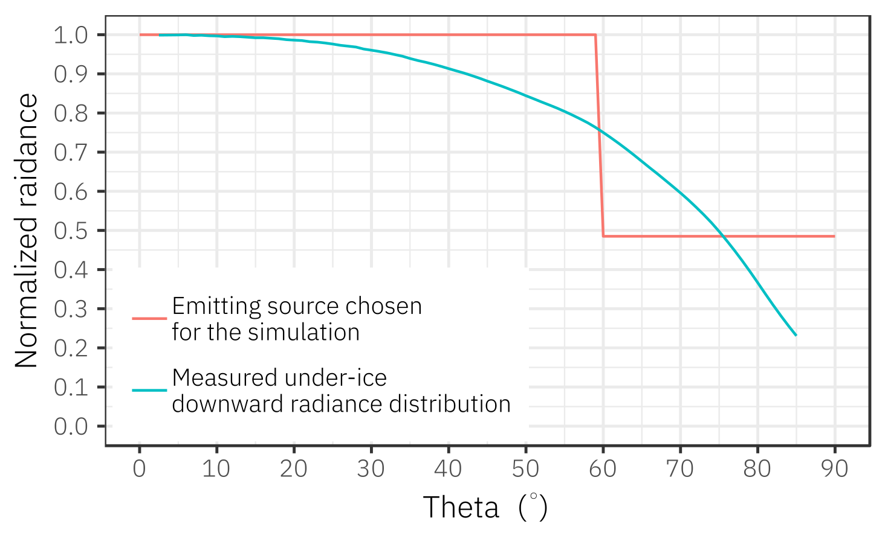
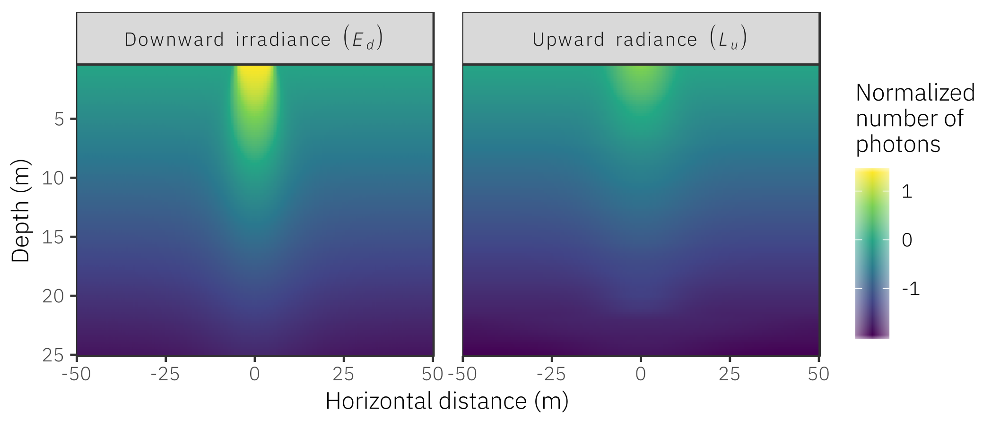
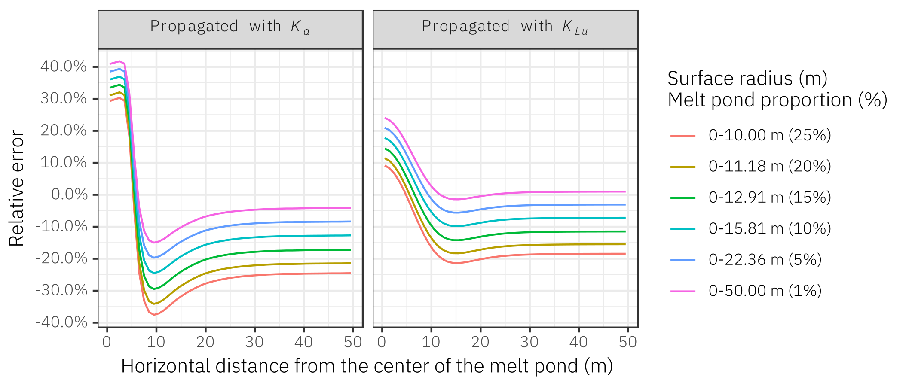

```{r setup, include=FALSE}
options(htmltools.dir.version = FALSE)

knitr::opts_chunk$set(
  comment = "#>",
  collapse = TRUE,
  cache = TRUE,
  out.width = "100%",
  fig.align = "center",
  # fig.width = 8,
  # fig.asp = 0.618, # 1 / phi
  fig.show = "hold",
  dev = "svg",
  message = FALSE,
  warning = FALSE,
  echo = FALSE
)

library(tidyverse)
library(ggpmthemes)
library(fontawesome)
library(knitr)
library(kableExtra)
library(patchwork)

theme_set(theme_exo(base_size = 12))
```

```{r xaringan-themer, include=FALSE}
library(xaringanthemer)
duo(
  code_font_family = "Fira Code",
  code_font_url = "https://cdn.rawgit.com/tonsky/FiraCode/1.204/distr/fira_code.css",
  text_font_google = google_font("Questrial"),
  inverse_background_color = "#ABB7B7",
  inverse_text_color = "#3c3c3c",
  inverse_header_color = "#3c3c3c", 
  background_color = "#3c3c3c", 
  header_color = "#B2CCE5", 
  title_slide_text_color = "#3c3c3c",
  title_slide_background_color = "#ABB7B7"
  # Yanone Kaffeesatz
)
```

```{r, cache=TRUE}
# Read COPS data for figures
cops <- data.table::fread(here::here("data/", "cops.csv.gz")) 
```

# Outlines

1. Challenges in estimating the vertical distribution of underwater light in ice-infested regions of the Arctic ocean.

2. A new method to estimate $K_d$ under sea ice-covered in melt ponds.

3. 3D Monte Carlo numerical simulations of radiative transfer.

4. Results

---

class: my-one-page-font, inverse, center, middle

# The vertical distribution of underwater light in the Arctic ocean

---

# The importance of underwater light

An adequate description of the underwater light regime is mandatory to understand energy fluxes in aquatic ecosystems.
  
- Primary production

- Photochemical reactions (photo-degradation)
  
- Energy budget in the water column

---

# Measuring light in open water

Nowadays, measuring downwelling irradiance, $E_d$, in open water is pretty straightforward.

.pull-left[

<center>
C-OPS deployment 
 
</center>
]

.pull-right[
```{r, fig.height=5}
source("https://gist.githubusercontent.com/friendly/67a7df339aa999e2bcfcfec88311abfc/raw/761a7688fba3668a84b2dfe42a655a1b246ca193/wavelength_to_rgb.R")

df <- cops %>% 
  filter(profile_filename == "GE2016.ICMP_ICEP_160706_CAST_004") %>% 
  # drop_na(edz) %>% 
  filter(between(wavelength, 400, 700))

color <- lapply(unique(df$wavelength), wavelength_to_rgb) %>% unlist()
color <- setNames(color, unique(df$wavelength))

df %>%
  drop_na(edz) %>% 
  ggplot(aes(x = edz, y = depth, color = factor(wavelength))) +
  geom_path() +
  scale_y_reverse(limits = c(50, 0)) +
  guides(color = guide_legend(ncol = 2)) +
  labs(color = "Wavelengths") +
  scale_color_manual(values = color) +
  xlab(bquote(mu*W%*%cm^{-2}%*%nm^{-1})) +
  ylab("Depth (m)")

```

]

---

# Mathematical formulation

Assuming an optically homogeneous water column, the decrease of light with increasing depth can be modeled as follow:

$$
E_d = E_d{(0^-)}e^{-K_d(z)z}
$$

- $K_d (m^{-1})$ is the vertical diffuse attenuation coefficient describing the rate at which light decreases with increasing depth.  

- An important metric used by biologists and to parameter models (**need for precise estimates**).

---

# Vertical light distribution in open water

```{r, fig.height = 4, fig.width = 6, out.width="80%"}
df <- cops %>% 
  filter(profile_filename == "GE2016.ICMP_ICEP_160706_CAST_005" & wavelength == 443)

mod <- minpack.lm::nlsLM(edz ~ a0 * exp(-k * depth), data = df, start = list(a0 = 0, k = 0.1))

df <- modelr::add_predictions(df, mod)

df %>% 
  ggplot(aes(x = edz, y = depth)) +
  geom_point(aes(color = "observations")) +
  geom_path(aes(x = pred, color = "model")) +
  scale_y_reverse(limits = c(50, 0)) +
  xlab(bquote(mu*W%*%cm^{-2}%*%nm^{-1})) +
  ylab("Depth (m)") +
  theme(legend.title = element_blank()) +
  theme(legend.position = c(0.8, 0.2)) +
  scale_color_manual(values = c("model" = "red", "observations" = "black")) +
  annotate("text", x = 20, y = 27, label = "Ed(z) == 38 * e^{-0.17 * z}", parse = TRUE) +
  labs(title = "Downwelling irradiance at 443 nm",
       subtitle = bquote(K[d]*"=0.17"~m^{-1}))
```


---

# Vertical light distribution in ice-covered water

Due to **spatial horizontal heterogeneity**, measuring vertical light profiles under ice cover presents considerable challenges in comparison to open water.

<center>

<figcaption>Credit: Joannie Ferland - Takuvik</figcaption>
</center>

---

# Vertical light distribution in ice-covered water

```{r, fig.height = 4, fig.width = 6, out.width="70%"}
source("https://gist.githubusercontent.com/friendly/67a7df339aa999e2bcfcfec88311abfc/raw/761a7688fba3668a84b2dfe42a655a1b246ca193/wavelength_to_rgb.R")

df <- cops %>% 
  filter(profile_filename == "GE2015.ICMP_ICEP_150430_CAST_004") %>% 
  # drop_na(edz) %>% 
  filter(between(wavelength, 400, 700))

color <- lapply(unique(df$wavelength), wavelength_to_rgb) %>% unlist()
color <- setNames(color, unique(df$wavelength))

df %>% 
  drop_na(edz) %>% 
  ggplot(aes(x = edz, y = depth, color = factor(wavelength))) +
  geom_path() +
  scale_y_reverse(limits = c(50, 0)) +
  guides(color = guide_legend(ncol = 2)) +
  labs(color = "Wavelengths") +
  scale_color_manual(values = color) +
  xlab(bquote(mu*W%*%cm^{-2}%*%nm^{-1})) +
  ylab("Depth (m)")
```

---

# Estimating $K_d$ underice

Estimating $K_{Ed}$ under ice represents a considerable challenge.

```{r, fig.height = 3, fig.width = 4, out.width="55%"}

df <- cops %>% 
  filter(profile_filename == "GE2015.ICMP_ICEP_150430_CAST_004" & wavelength == 443)

mod <- minpack.lm::nlsLM(edz ~ a0 * exp(-k * depth), data = df, start = list(a0 = 0, k = 0.1))

df <- modelr::add_predictions(df, mod)

df %>% 
  ggplot(aes(x = edz, y = depth)) +
  geom_point(aes(color = "observations")) +
  geom_path(aes(x = pred, color = "model")) +
  scale_y_reverse(limits = c(50, 0)) +
  xlab(bquote(mu*W%*%cm^{-2}%*%nm^{-1})) +
  ylab("Depth (m)") +
  theme(legend.title = element_blank()) +
  theme(legend.position = c(0.8, 0.2)) +
  scale_color_manual(values = c("model" = "red", "observations" = "black")) +
  annotate("text", x = 0.05, y = 10, label = "Ed(z) == 0.19 * e^{-0.03 * z}", parse = TRUE)
```

---

# The main objective

Propose **a new method to estimate average irradiance over large spatially heterogeneous area** as it would be seen by drifting phytoplankton.

---

# Upward radiance: A New Hope

One promising way is to use **upwelling radiance, $L_u$,** which is far less influenced by the surface spatial heterogeneity.

<center>

</center>

---

# Why upward radiance?

Not influenced by the surface spatial heterogeneity (**no subsurface maximum**).

```{r, fig.height = 4, fig.width = 9, out.width="90%"}
df <- cops %>% 
  filter(profile_filename == "GE2016.ICMP_ICEP_160620_CAST_006") %>% 
  filter(wavelength == 443)
 
p1 <- df %>%
  group_by(profile_filename, wavelength) %>% 
  mutate_at(.vars = vars(edz, luz), function(x) x / max(x, na.rm = TRUE)) %>% 
  ggplot(aes(y = depth, color = factor(wavelength))) +
  geom_path(aes(x = edz, color = "Ed(z)")) +
  geom_path(aes(x = luz, color = "Lu(z)")) +
  scale_y_reverse(limits = c(50, 0)) +
  labs(color = "Light type") +
  xlab("Normalized light") +
  ylab("Depth (m)") +
  theme(
    legend.position = "none"
  ) +
  geom_hline(yintercept = 10, lty = 2, size = 0.25)

p2 <- df %>%
  filter(depth >= 10) %>% 
  group_by(profile_filename, wavelength) %>% 
  mutate_at(.vars = vars(edz, luz), function(x) x / max(x, na.rm = TRUE)) %>% 
  ggplot(aes(y = depth, color = factor(wavelength))) +
  geom_path(aes(x = edz, color = "Ed(z)")) +
  geom_path(aes(x = luz, color = "Lu(z)")) +
  scale_y_reverse(limits = c(50, 0)) +
  labs(color = "Light type") +
  xlab("Normalized light") +
  ylab("Depth (m)") +
  geom_hline(yintercept = 10, lty = 2, size = 0.25)

p1 + p2 +
  plot_annotation(
    title = "Downwelling irradiance vs upwelling radiance at 443 nm",
    subtitle = "\nProfiles have been normalized to their maximum."
  )

```

---

# What we did

- Prove that $K_{Lu}$ can be used as a proxy to estimate the mean $\overline{K_{d}}$ in the water column using:
  
  - *in-situ* C-OPS measurements (a total of 83 vertical light profiles were acquired)
  
  - Monte-Carlo simulations

---

class: my-one-page-font, inverse, center, middle

# In-situ underwater light measurements at the ice camp

---

class: my-one-page-font, inverse, center, middle

# 3D Monte Carlo numerical simulations of radiative transfer

---

# 3D Monte Carlo numerical simulations

SimulO was used to simulate the propagation of light under a sea-ice surface containing a 5-meters radius melt pond.

```{r, fig.height = 4, fig.width = 9, out.width="90%"}
# Plot 1 ------------------------------------------------------------------

circle <- function(radius, angle = seq(0, 2 * pi, length.out = 200)) {
  tibble(
    x = radius * cos(angle),
    y = radius * sin(angle)
  )
}

r <- c(seq(5.5, 50, by = 5), 50)

sampling_circle <- map(r, circle) %>%
  set_names(r) %>%
  bind_rows(.id = "radius") %>%
  mutate(radius = parse_number(radius))

melt_pond <- circle(5)

configuration <- map2(sqrt(25 / c(0.25, 0.20, 0.15, 0.10, 0.05, 0.01)), seq(0, pi / 2, length.out = 6), circle) %>%
  set_names(c(0.25, 0.20, 0.15, 0.10, 0.05, 0.01)) %>%
  bind_rows(.id = "radius") %>%
  mutate(radius = parse_number(radius))

frame <- tibble(xmin = -50, xmax = 50, ymin = -50, ymax = 50)

p1 <- ggplot() +
  geom_rect(data = frame, aes(xmin = xmin, xmax = xmax, ymin = ymin, ymax = ymax), fill = "transparent", color = "#57e5d6") +
  geom_path(data = sampling_circle, aes(x = x, y = y, color = factor(radius)), size = 0.25) +
  geom_polygon(data = melt_pond, aes(x = x, y = y, fill = "Melt pond")) +
  scale_x_continuous(limits = c(-50, 50)) +
  scale_y_continuous(limits = c(-50, 50)) +
  scale_fill_manual(values = c("Melt pond" = "#6097ce")) +
  # scale_color_brewer(palette = "BuPu") +
  labs(fill = "") +
  labs(color = "Sampling\ndistance (m)") +
  xlab(bquote(italic(x) * "-distance (m)")) +
  ylab(bquote(italic(y) * "-distance (m)")) +
  geom_segment(data = configuration, aes(x = 0, y = 0, xend = x, yend = y, group = radius), size = 0.25) +
  geom_label(data = configuration, aes(x = x, y = y, label = sprintf("%2.0f%% melt pond cover", radius * 100)), hjust = 0, label.size = 0, nudge_x = 1, size = 2, label.padding = unit(0.05, "lines")) +
  guides(color = guide_legend(
    keywidth = 0.15,
    keyheight = 0.15,
    default.unit = "inch",
    nrow = 4
  )) +
  theme(
    legend.position = "none"
  ) +
  coord_equal()

# Plot 2 ------------------------------------------------------------------

frame <- tibble(xmin = -120, xmax = 120, ymin = -150, ymax = 0)
segment <- tibble(x = rep(-120, 6), y = seq(-25, 0, by = 5), xend = rep(120, 6), yend = seq(-25, 0, by = 5))
ice <- tibble(xmin = -120, xmax = 120.25, ymin = 0, ymax = 5)
mp <- tibble(xmin = -5, xmax = 5, ymin = 0, ymax = 5)

p2 <- ggplot() +
  geom_rect(data = frame, aes(xmin = xmin, xmax = xmax, ymin = ymin, ymax = ymax), fill = "transparent", color = "black") +
  geom_segment(data = segment, aes(x = x, y = y, xend = xend, yend = yend), lty = 2, size = 0.25) +
  geom_rect(data = ice, aes(xmin = xmin, xmax = xmax, ymin = ymin, ymax = ymax), fill = "#36454F") +
  geom_rect(data = mp, aes(xmin = xmin, xmax = xmax, ymin = ymin, ymax = ymax), fill = "#6097ce", color = "transparent") +
  annotate("segment", x = -50, xend = -50, y = 0, yend = -25, lty = 1, size = 0.75, color = "#57e5d6") +
  annotate("segment", x = 50, xend = 50, y = 0, yend = -25, lty = 1, size = 0.75, color = "#57e5d6") +
  annotate("segment", x = 50, xend = -50, y = -25, yend = -25, lty = 1, size = 0.75, color = "#57e5d6") +

  annotate("text", x = 35, y = -50, label = str_wrap("3D volume for which simulated data was extracted", width = 30), size = 3, family = "IBM Plex Sans Light") +
  annotate("segment", x = 25, xend = 25, y = -40, yend = -28, lty = 1, size = 0.25, arrow = arrow(length = unit(1.5, "mm"))) +

  annotate("text", x = -75, y = -50, label = str_wrap("2D detectors placed every 0.5 m depth", width = 20), size = 3, family = "IBM Plex Sans Light") +
  annotate("segment", x = -75, xend = -75, y = -40, yend = -28, lty = 1, size = 0.25, arrow = arrow(length = unit(1.5, "mm"))) +

  # annotate("label", x = 28, y = -5, label = "Melt pond", size = 3, label.size = NA) +
  # annotate("segment", x = 10, xend = 5, y = -5, yend = -2, lty = 1, size = 0.25, arrow = arrow(length = unit(1.5, "mm"))) +

  annotate("segment", x = 0, xend = 0, y = 0, yend = -15, lty = 1, size = 1, arrow = arrow(length = unit(1.5, "mm")), color = "orange") +
  annotate("segment", x = 0, xend = 10, y = 0, yend = -10, lty = 1, size = 1, arrow = arrow(length = unit(1.5, "mm")), color = "orange") +
  annotate("segment", x = 0, xend = -10, y = 0, yend = -10, lty = 1, size = 1, arrow = arrow(length = unit(1.5, "mm")), color = "orange") +

  annotate("segment", x = 75, xend = 75, y = 0, yend = -15, lty = 1, size = 0.25, arrow = arrow(length = unit(1.5, "mm")), color = "orange") +
  annotate("segment", x = 75, xend = 85, y = 0, yend = -10, lty = 1, size = 0.25, arrow = arrow(length = unit(1.5, "mm")), color = "orange") +
  annotate("segment", x = 75, xend = 65, y = 0, yend = -10, lty = 1, size = 0.25, arrow = arrow(length = unit(1.5, "mm")), color = "orange") +

  annotate("segment", x = -75, xend = -75, y = 0, yend = -15, lty = 1, size = 0.25, arrow = arrow(length = unit(1.5, "mm")), color = "orange") +
  annotate("segment", x = -75, xend = -85, y = 0, yend = -10, lty = 1, size = 0.25, arrow = arrow(length = unit(1.5, "mm")), color = "orange") +
  annotate("segment", x = -75, xend = -65, y = 0, yend = -10, lty = 1, size = 0.25, arrow = arrow(length = unit(1.5, "mm")), color = "orange") +

  annotate("text", x = -110, y = -100, label = "Homogeneous water column:", size = 3.5, hjust = 0, fontface = 2, family = "IBM Plex Sans Light") +
  annotate("text", x = -110, y = -110, label = expression(italic(a) * "=" * italic(b) * "=" * 0.05 * m^{
    -1
  }), size = 3, hjust = 0, family = "IBM Plex Sans Light", parse = TRUE) +
  annotate("text", x = -110, y = -120, label = "VSF: Fourrier-Forand 3%", size = 3, hjust = 0, family = "IBM Plex Sans Light") +

  theme(panel.grid = element_blank()) +
  theme(panel.border = element_blank()) +
  scale_x_continuous(expand = c(0, 0), limits = c(-120, 120.25)) +
  scale_y_continuous(expand = c(0, 0), breaks = seq(-150, 0, by = 20)) +
  xlab("Horizontal distance (m)") +
  ylab("Depth (m)") +
  coord_equal()

p1 + p2
```

---

# Under-ice measured downward radiance distribution

The angular distribution and magnitude of the light field emitted by the surface were chosen to mimic observed field data.

<center>

</center>

---

class: my-one-page-font, inverse, center, middle

# Main results

---

# Simulating the under-ice light field

The under-ice light estimated using $L_u$ field **is less influenced by the melt pond** compared to the light field estimated using $E_d$.

<center>

</center>

---

# Simulating the under-ice light field

The vertical light profiles propagated in the water column using either $K_{Ed}$ or $K_{Lu}$.

```{r fig10, fig.height = 6, fig.width = 9, out.width="60%"}

scientific_10x <- function(x) {
  parse(text = gsub("e", "%*%10^", scales::scientific_format()(x)))
}

simulo <- feather::read_feather(here::here("data", "simulo_4_lambertian_sources_smoothed_radiance.feather"))

reference_profile <- simulo %>%
  mutate(class_25_percent = as.character(cut(mid_distance, breaks = c(0, sqrt(25 / 0.25)), include.lowest = TRUE, right = TRUE, dig.lab = 5))) %>%
  mutate(class_20_percent = as.character(cut(mid_distance, breaks = c(0, sqrt(25 / 0.20)), include.lowest = TRUE, right = TRUE, dig.lab = 5))) %>%
  mutate(class_15_percent = as.character(cut(mid_distance, breaks = c(0, sqrt(25 / 0.15)), include.lowest = TRUE, right = TRUE, dig.lab = 5))) %>%
  mutate(class_10_percent = as.character(cut(mid_distance, breaks = c(0, sqrt(25 / 0.10)), include.lowest = TRUE, right = TRUE, dig.lab = 5))) %>%
  mutate(class_05_percent = as.character(cut(mid_distance, breaks = c(0, sqrt(25 / 0.05)), include.lowest = TRUE, right = TRUE, dig.lab = 5))) %>%
  mutate(class_01_percent = as.character(cut(mid_distance, breaks = c(0, sqrt(25 / 0.01)), include.lowest = TRUE, right = TRUE, dig.lab = 5)))

reference_profile <- reference_profile %>%
  gather(class_distance, range, starts_with("class")) %>%
  drop_na(range)

reference_profile <- reference_profile %>%
  group_by(depth, source, range) %>%
  summarise(value = mean(value)) %>%
  ungroup()

simulo <- data.table::fread(here::here("data", "simulo_4_lambertian_sources.csv.gz")) %>% 
  filter(between(pixel_distance_to_center, 0, 50))

## Calculate average light profiles
averaged_simulo <- simulo %>%
  mutate(iso_distance = cut_interval(pixel_distance_to_center, n = 50)) %>%
  separate(iso_distance, into = c("start_distance", "end_distance"), sep = ",") %>%
  mutate_at(vars(start_distance, end_distance), parse_number) %>%
  mutate(mid_distance = start_distance + (end_distance - start_distance) / 2) %>%
  group_by(depth, source, mid_distance) %>%
  summarise(value = mean(value)) %>%
  ungroup()

# Fit a Guassian curve on raidance data to remove noise -------------------

fit_gaussian <- function(df, depth) {
    mod <- minpack.lm::nlsLM(
    radiance ~ a1 * exp(-((mid_distance - b1) ^ 2 / (2 * c1 ^ 2))) + k,
    data = df,
    start = list(
      a1 = mean(df$radiance),
      b1 = 0,
      c1 = 5,
      k = mean(df$radiance)
    ),
    lower = c(
      a1 = 0,
      b1 = 0,
      c1 = 5, # Limit to 5 because some have very high value outliers at 0 m (center of the melt pond)
      k = 0
    ),
    upper = c(
      a1 = max(df$radiance),
      b1 = 0,
      c1 = Inf,
      k = max(df$radiance)
    ),
    control = nls.lm.control(maxiter = 1024)
  )
  
  return(mod)
}


averaged_simulo <- averaged_simulo %>% 
  bind_rows(mutate(averaged_simulo, mid_distance = -mid_distance)) %>% 
  distinct()

averaged_simulo <- averaged_simulo %>% 
  spread(source, value)

library(minpack.lm)
library(modelr)
averaged_simulo <- averaged_simulo %>%
  group_by(depth) %>%
  nest() %>%
  mutate(mod = map2(data, depth, fit_gaussian)) %>% 
  mutate(pred = map2(data, mod, add_predictions)) %>% 
  unnest(pred)

## Replace radiance data with smoothed value (Gaussian fits)
averaged_simulo <- averaged_simulo %>% 
  select(-radiance) %>% 
  rename(radiance = pred) %>% 
  gather(source, value, intensity, radiance) %>% 
  filter(mid_distance >= 0) %>% 
  mutate(source = ifelse(source == "radiance", "Radiance (Lu)", "Irradiance (Ed)"))

## Calculate K only starting at 0 meters
averaged_simulo <- averaged_simulo %>%
  filter(between(mid_distance, 0, 50))

averaged_simulo_norm <- averaged_simulo %>%
  group_by(source, mid_distance) %>%
  mutate(value = value / max(value)) ## normalize, easier to fit

k <- averaged_simulo_norm %>%
  nest() %>%
  mutate(mod = map(data, ~ minpack.lm::nlsLM(value ~ a0 * exp(-k * depth), data = ., start = list(a0 = 1, k = 0.02)))) %>%
  mutate(k = map_dbl(mod, ~ coef(.)[2])) %>%
  mutate(pred = map2(data, mod, modelr::add_predictions)) %>% 
  mutate(r2 = map2_dbl(mod, data, modelr::rsquare))

## Propagate light 

k <- k %>%
  select(source, mid_distance, k)

predicted_light <- reference_profile %>%
  filter(source == "Irradiance (Ed)") %>%
  filter(depth == 0.5) %>% ## Propagate the value at 0.5m
  bind_rows(mutate(., source = ifelse(source == "Irradiance (Ed)", "Radiance (Lu)", "source"))) %>%
  left_join(k) %>%
  group_by(source, range, mid_distance) %>%
  nest() %>%
  mutate(predicted_light = map(data, function(x) {
    depth <- seq(0.5, 25, by = 0.5)
    predicted_light <- x$value * exp(-x$k * (depth - 0.5))
    
    tibble(depth, predicted_light)
  })) %>%
  unnest(predicted_light)

## Only keep Ed profiles. Double the rows of the df and set the new lines as
## "radiance". This is just to make computation easier.
reference_profile <- reference_profile %>%
  filter(source == "Irradiance (Ed)") %>%
  bind_rows(mutate(., source = ifelse(source == "Irradiance (Ed)", "Radiance (Lu)", "source")))

## Visualize

labels <- c(
  "Irradiance (Ed)" = "Propagated with Kd",
  "Radiance (Lu)" = "Propagated with KLu"
)

predicted_light2 <- predicted_light %>% 
  mutate(source2 = ifelse(source == "Irradiance (Ed)", "Propagated~with~italic(K[d])", "Propagated~with~italic(K[Lu])"))

reference_profile %>%
  filter(range %in% c("[0,10]", "[0,12.91]", "[0,50]")) %>% 
  mutate(source2 = ifelse(source == "Irradiance (Ed)", "Propagated~with~italic(K[d])", "Propagated~with~italic(K[Lu])")) %>% 
  ggplot(aes(x = value, y = depth)) +
  facet_grid(range ~ source2, scales = "free", labeller = labeller(source2 = label_parsed, range = label_value)) +
  scale_y_reverse() +
  geom_path(data = predicted_light2 %>% filter(range %in% c("[0,10]", "[0,12.91]", "[0,50]")), aes(x = predicted_light, color = mid_distance, group = mid_distance), size = 0.25) +
  geom_path(size = 1) +
  labs(color = str_wrap("Distance from the center of the melt pond (m)", 20)) +
  scale_x_continuous(labels = scientific_10x, breaks = c(0, 3, 6)*1e6, limits = c(0, NA), expand = c(0.15, 0)) +
  ylab("Depth (m)") +
  xlab("Downward irradiance") +
  theme(strip.text.y = element_text(size = 8)) +
  scale_color_viridis_c()
```

---

# The mean relative errors

- Decrease as measurements are made away from the melt pond.
- **Lower by approximately a factor of two** when using $K_{Lu}$ (~7%) compared to $K_{Ed}$ (~12%).

<center>

</center>

---

class: my-one-page-font, inverse, center, middle

# Take home messages

---

# Take home messages

--

1. Our results show that under spatially heterogeneous sea ice at the surface (and for a homogeneous water column), the average irradiance profile, $E_d(z)$, is well reproduced by a single exponential function.

--

2. $K_{Lu}$, which is up to two times less influenced by a heterogeneous incident light field than $K_{Ed}$ in the vicinity of a melt pond, can be used as a proxy to estimate Ed(z) in the water column.

--

3. The effect of a melt pond with a diameter of 5 m is minimized at a horizontal distance of approximately 20 m.

---

# Questions?

Massicotte P, Bécu G, Lambert-Girard S, Leymarie E, Babin M. Estimating Underwater Light Regime under Spatially Heterogeneous Sea Ice in the Arctic. Applied Sciences. 2018; 8(12):2693.
