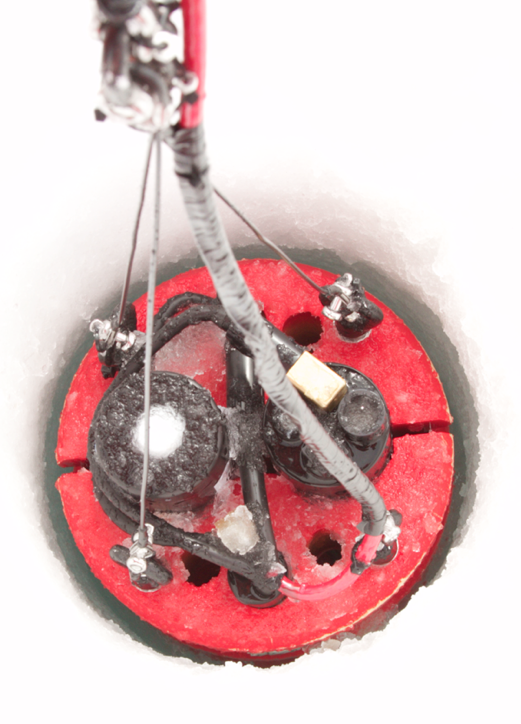
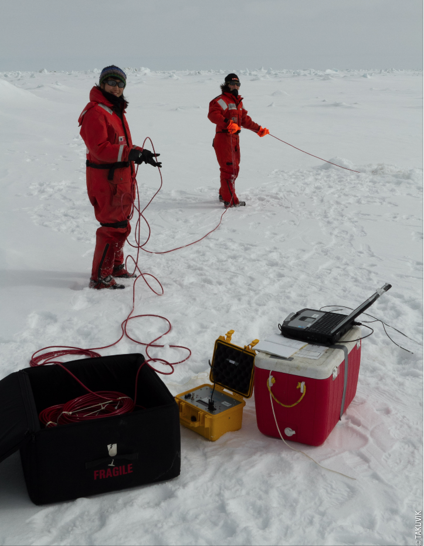
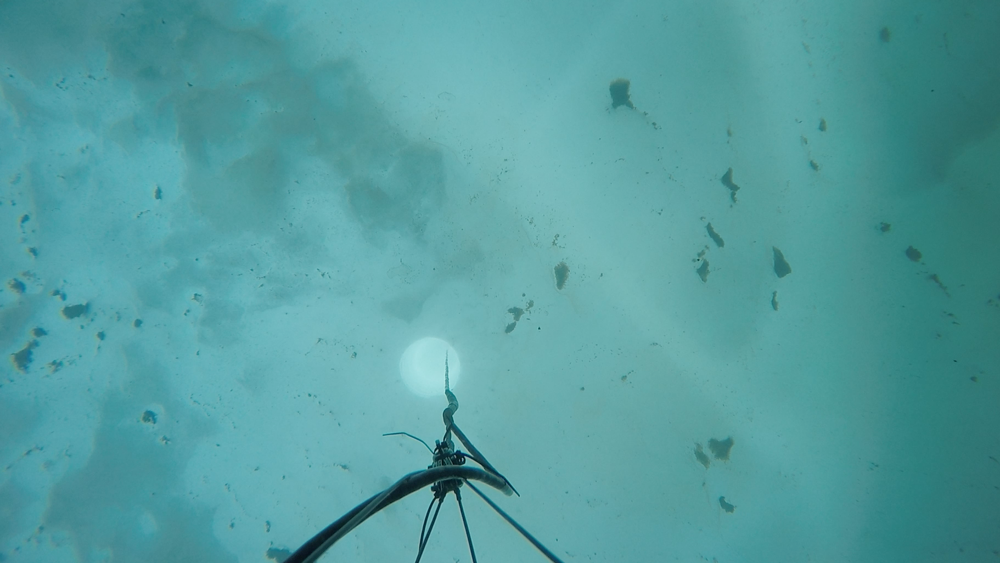
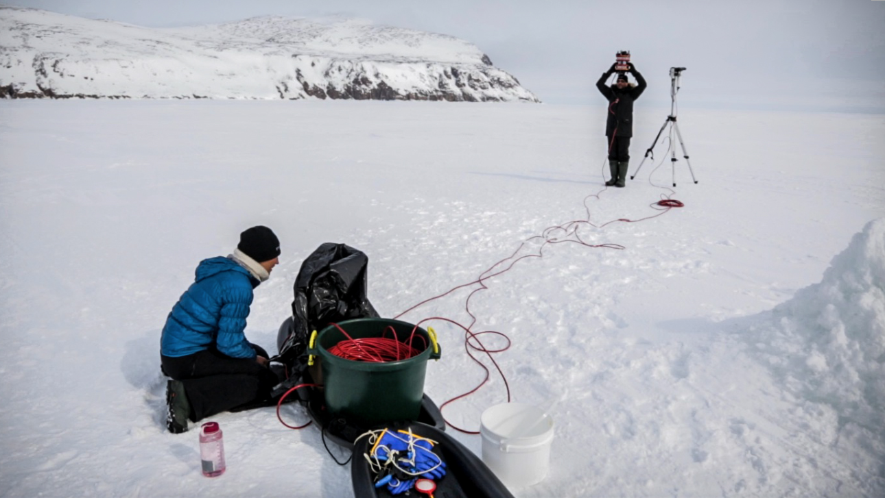

```{r setup, include=FALSE}
options(htmltools.dir.version = FALSE)

knitr::opts_chunk$set(
  comment = "#>",
  collapse = TRUE,
  cache = TRUE,
  out.width = "100%",
  fig.align = "center",
  # fig.width = 8,
  # fig.asp = 0.618, # 1 / phi
  fig.show = "hold",
  dev = "svg",
  message = FALSE,
  warning = FALSE,
  echo = FALSE
)

library(tidyverse)
library(ggpmthemes)
library(fontawesome)
library(knitr)
library(kableExtra)
library(patchwork)
library(ggtext)

theme_set(theme_poppins(base_size = 12))

source("https://gist.githubusercontent.com/friendly/67a7df339aa999e2bcfcfec88311abfc/raw/761a7688fba3668a84b2dfe42a655a1b246ca193/wavelength_to_rgb.R")
```

```{r xaringan-themer, include=FALSE}
library(xaringanthemer)
duo(
  code_font_family = "Fira Code",
  code_font_url = "https://cdn.rawgit.com/tonsky/FiraCode/1.204/distr/fira_code.css",
  text_font_google = google_font("Questrial"),
  inverse_background_color = "#ABB7B7",
  inverse_text_color = "#3c3c3c",
  inverse_header_color = "#3c3c3c", 
  background_color = "#3c3c3c", 
  header_color = "#B2CCE5", 
  title_slide_text_color = "#3c3c3c",
  title_slide_background_color = "#ABB7B7"
  # Yanone Kaffeesatz
)
```

```{r, cache=TRUE}
# Read COPS data for figures
cops <- data.table::fread(here::here("data/", "cops.csv.gz")) 
```

class: my-one-page-font, inverse, center, middle

# The vertical distribution of underwater light in open water

An overview

---

# The importance of underwater light

An adequate description of the underwater light regime is mandatory to understand energy fluxes in aquatic ecosystems.

--

- Primary production

--

- Photochemical reactions (photo-degradation)

--

- Energy budget in the water column

---

# Measuring light in open water

In open water, downwelling irradiance, $E_d$, decreases exponentially with increasing depth.

```{r, fig.height = 3.5, fig.width = 5, out.width="60%"}
df <- cops %>% 
  filter(profile_filename == "GE2016.ICMP_ICEP_160706_CAST_004") %>% 
  # drop_na(edz) %>% 
  filter(between(wavelength, 400, 700))

color <- lapply(unique(df$wavelength), wavelength_to_rgb) %>% unlist()
color <- setNames(color, unique(df$wavelength))

df %>%
  drop_na(edz) %>% 
  ggplot(aes(x = edz, y = depth, color = factor(wavelength))) +
  geom_path() +
  scale_y_reverse(limits = c(50, 0)) +
  guides(color = guide_legend(ncol = 2)) +
  labs(
    color = "Wavelength (nm)",
    title = "Vertical irradiance profiles",
    subtitle = "Measured on 2016-07-06 in open water"

  ) +
  scale_color_manual(values = color) +
  xlab(bquote(E[d]~(mu*W%*%~cm^{-2}))) +
  ylab("Depth (m)")
```

---

# Mathematical formulation

**Assuming an optically homogeneous water column**, the decrease of light with increasing depth can be modeled as follow:

$$
E_d = E_d{(0^-)}e^{-K_d(z)z}
$$

- $K_d(z)~[m^{-1}]$ is the vertical diffuse attenuation coefficient describing the rate at which light decreases with increasing depth.  

- An important metric used by biologists and to parameter models (**need for precise estimates**).

---

# Vertical light distribution in open water

In **optically homogeneous water**, downward irradiance follows quite well a monotonically exponential decrease with depth.

```{r, fig.height = 4, fig.width = 6, out.width="55%"}
df <- cops %>% 
  filter(profile_filename == "GE2016.ICMP_ICEP_160706_CAST_005" & wavelength == 443)

mod <- minpack.lm::nlsLM(edz ~ a0 * exp(-k * depth), data = df, start = list(a0 = 0, k = 0.1))

df <- modelr::add_predictions(df, mod)

df %>% 
  ggplot(aes(x = edz, y = depth)) +
  geom_point(aes(color = "Observations"), show.legend = FALSE) +
  geom_path(aes(x = pred, color = "Model")) +
  scale_y_reverse(limits = c(50, 0)) +
  xlab(bquote(E[d]~(mu*W%*%~cm^{-2}))) +
  ylab("Depth (m)") +
  theme(legend.title = element_blank()) +
  theme(legend.position = c(0.85, 0.2)) +
  scale_color_manual(values = c("Model" = "#E73E26", "Observations" = "black")) +
  annotate("text", x = 20, y = 27, label = "Ed(z) == 38 * e^{-0.17 * z}", parse = TRUE, size = 6) +
  labs(
    title = "Downwelling irradiance at 443 nm",
    subtitle = "Profile measured in open water"
  )
```

---

class: my-one-page-font, inverse, center, middle

# Vertical light distribution in ice-covered water

Current challenges

---

# Vertical light distribution in ice-covered water

Due to **spatial horizontal heterogeneity**, measuring vertical light profiles under ice cover presents considerable challenges in comparison to open water.

<center>

<figcaption>Photo: Joannie Ferland</figcaption>
</center>

---

# Vertical light distribution in ice-covered water

In ice-covered water, **subsurface light maxima at a depth of around 10 m** are visible between 400 and 560 nm.

```{r, fig.height = 4, fig.width = 6, out.width="60%"}
df <- cops %>% 
  filter(profile_filename == "GE2015.ICMP_ICEP_150430_CAST_004") %>% 
  # drop_na(edz) %>% 
  filter(between(wavelength, 400, 700))

color <- lapply(unique(df$wavelength), wavelength_to_rgb) %>% unlist()
color <- setNames(color, unique(df$wavelength))

df %>% 
  drop_na(edz) %>% 
  ggplot(aes(x = edz, y = depth, color = factor(wavelength))) +
  geom_path() +
  scale_y_reverse(limits = c(50, 0)) +
  guides(color = guide_legend(ncol = 2)) +
  labs(
    color = "Wavelengths",
    title = str_wrap("Vertical profiles of irradiance at different wavelengths", 40)
  ) +
  scale_color_manual(values = color) +
  xlab(bquote(E[d]~(mu*W%*%~cm^{-2}))) +
  ylab("Depth (m)") +
  geom_hline(yintercept = 10, lty = 2)
```

---

# Estimating $K_d$ underice

Estimating $K_{Ed}$ under ice represents a considerable challenge.

```{r, fig.height = 4, fig.width = 6, out.width="60%"}

df <- cops %>% 
  filter(profile_filename == "GE2015.ICMP_ICEP_150430_CAST_004" & wavelength == 443)

mod <- minpack.lm::nlsLM(edz ~ a0 * exp(-k * depth), data = df, start = list(a0 = 0, k = 0.1))

df <- modelr::add_predictions(df, mod)

df %>% 
  ggplot(aes(x = edz, y = depth)) +
  geom_point(aes(color = "Observations"), show.legend = FALSE) +
  geom_path(aes(x = pred, color = "Model")) +
  scale_y_reverse(limits = c(50, 0)) +
  xlab(bquote(E[d]~(mu*W%*%cm^{-2}))) +
  ylab("Depth (m)") +
  theme(legend.title = element_blank()) +
  theme(legend.position = c(0.75, 0.2)) +
  scale_color_manual(values = c("Model" = "#E73E26", "Observations" = "black")) +
  annotate("text", x = 0.05, y = 10, label = "Ed(z) == 0.19 * e^{-0.03 * z}", parse = TRUE, size = 6) +
  labs(
    title = "Downwelling irradiance at 443 nm",
    subtitle = "Profile measured under an heterogeneous snow/sea ice surface"
  )
```

---

class: my-one-page-font, inverse, center, middle

# The main objective

<b><i>Propose a new method to estimate average irradiance profile, $\overline{E_d}(z)$, over a large spatially heterogeneous area.</i></b>

From a given $E_d(0^-)$ measured or modelled right under the ice sheet.

---

# Upward radiance: A New Hope

One promising way is to use **upwelling radiance, $L_u$,** which is far less influenced by the surface spatial heterogeneity.

<center>

</center>

---

# Upward radiance: A New Hope

Upward radiance is less influenced by the surface spatial heterogeneity (**no subsurface maximum**).

```{r, fig.height = 4, fig.width = 9, out.width="90%"}
df <- cops %>% 
  filter(profile_filename == "GE2016.ICMP_ICEP_160620_CAST_006") %>% 
  filter(wavelength == 443)
 
p1 <- df %>%
  group_by(profile_filename, wavelength) %>% 
  mutate_at(.vars = vars(edz, luz), function(x) x / max(x, na.rm = TRUE)) %>% 
  ggplot(aes(y = depth, color = factor(wavelength))) +
  geom_path(aes(x = edz, color = "Ed(z)")) +
  geom_path(aes(x = luz, color = "Lu(z)")) +
  scale_y_reverse(limits = c(50, 0)) +
  labs(color = "Light type") +
  xlab("Normalized light") +
  ylab("Depth (m)") +
  theme(
    legend.position = "none"
  ) +
  geom_hline(yintercept = 10, lty = 2, size = 0.25) +
  paletteer::scale_color_paletteer_d(ggthemes, wsj_colors6) +
  labs(
    subtitle = "Profiles normalized at their maximum."
  )

p2 <- df %>%
  filter(depth >= 10) %>% 
  group_by(profile_filename, wavelength) %>% 
  mutate_at(.vars = vars(edz, luz), function(x) x / max(x, na.rm = TRUE)) %>% 
  ggplot(aes(y = depth, color = factor(wavelength))) +
  geom_path(aes(x = edz, color = "Ed(z)")) +
  geom_path(aes(x = luz, color = "Lu(z)")) +
  scale_y_reverse(limits = c(50, 0)) +
  labs(
    color = "Light type",
    subtitle = "Profiles normalized at 10 m."
  ) +
  xlab("Normalized light") +
  ylab("Depth (m)") +
  geom_hline(yintercept = 10, lty = 2, size = 0.25) +
  paletteer::scale_color_paletteer_d(ggthemes, wsj_colors6)

p1 + 
  p2 +
  plot_annotation(
    title = "Downwelling irradiance vs upwelling radiance at 443 nm",
    subtitle = "<i style='color:#E23636'>At 10 m depth, the effects of surface heterogeneity is reduced.</i>",
    theme = theme(
      plot.title = element_text(margin = margin(6, 6, 6, 6)), 
      plot.subtitle = element_markdown(lineheight = 1.1)
    )
  )

```

---

# Why upward radiance?

**Below 10 meters**, the downward and upward attenuation coefficients are correlated. 

```{r, fig.height = 3.5, fig.width = 9, out.width="100%"}

# Plot ked vs klu ---------------------------------------------------------

k <- data.table::fread("data/k_cops.csv.gz") %>% 
  as_tibble()

r2_threshold <- 0.99

k2 <- k %>%
  filter(r2 >= r2_threshold & k > 0) %>% 
  unite(depth_range, start_depth, end_depth, remove = FALSE, sep = "-") %>% 
  dplyr::select(profile_filename, depth_range, type, wavelength, k) %>% 
  spread(type, k) %>% 
  rename(ked = edz, klu = luz) %>% 
  drop_na(ked, klu) %>% 
  filter(wavelength < 589) %>% 
  filter(depth_range %in% c("10-15", "40-45", "75-80")) 

color <- lapply(unique(k2$wavelength), wavelength_to_rgb) %>% unlist()
color <- setNames(color, unique(k2$wavelength))

appender <- function(string, suffix = " m") paste0(string, suffix)

k2 %>% 
  ggplot(aes(x = klu, y = ked)) +
  ggpointdensity::geom_pointdensity(aes(color = factor(wavelength)), size = 2, adjust = 0.5) +
  # geom_point(aes(color = factor(wavelength)), size = 3) +
  geom_smooth(method = "lm", se = FALSE, size = 1, color = "#E73E26") +
  geom_abline(slope = 1, intercept = 0, lty = 2, color = "grey50", size = 1) +
  facet_wrap(~depth_range, scales = "free", ncol = 3, labeller = as_labeller(appender)) +
  scale_color_manual(values = color) +
  xlab(bquote(italic(K[Lu])~(m^{-1}))) +
  ylab(bquote(italic(K[d])~(m^{-1}))) +
  scale_x_continuous(breaks = scales::pretty_breaks(n = 3)) +
  scale_y_continuous(breaks = scales::pretty_breaks(n = 3)) +
  labs(
    color = "Wavelength (nm)",
    title = str_wrap("Attenuation coefficients for downwelling and upwelling radiance are very similar", 50),
    subtitle = "<span style='color:#E23636'>The red region</span> is not shown because there is a decoupling between <i>K<sub>d</sub></i> and <i>K<sub>Lu</sub></i> at longer<br>wavelengths, possibly due to <span style='color:#E23636'>inelastic Raman scattering</span>."
  ) +
  guides(color = guide_legend(
    keywidth = 0.15,
    keyheight = 0.15,
    default.unit = "inch",
    ncol = 2
  )) +
  theme(
    plot.subtitle = element_markdown()
  )
```


---

# What we did

- Show that $K_{Lu}$ can be used as a proxy to estimate the mean $\overline{K_{d}}$ in the water column.

- **In other words, is it better to use $K_{Lu}$ rather then $K_{Ed}$?**

Based on:
  
- *in-situ* C-OPS measurements
  
- Monte-Carlo simulations (using SimulO, a software developped by Edouard Leymarie)

---

class: my-one-page-font, inverse, center, middle

# In-situ underwater light measurements at the ice camp

---

# Sampling at the ice camp

Between 20 April and 27 July 2016 (water depth: 360 m).


```{r, fig.height = 3.5, fig.width = 6, out.width="70%"}
df <- read_csv("data/greenedge_ice_thick.csv")

df <- df %>% 
  select(mission, date, sample_type, snow_thickness, sample_thickness_cm_average) %>% 
  group_by(mission, date, sample_type) %>% 
  summarise(sample_thickness_cm_average = mean(sample_thickness_cm_average)) %>% 
  spread(sample_type, sample_thickness_cm_average) %>% 
  mutate(yday = lubridate::yday(date)) %>% 
  filter(mission == "ice_camp_2016")

df %>%
  ggplot(aes(x = yday)) +
  geom_ribbon(aes(ymin = 0, ymax = snow, fill = "Snow")) +
  geom_ribbon(aes(ymin = -ice, ymax = 0, fill = "Ice")) +
  scale_x_continuous(
    breaks = seq(as.Date("2015-01-01"), as.Date("2015-12-31"), by = "1 month") %>% lubridate::yday(),
    # limits = c(110, 190),
    labels = function(x) {
      as.Date(paste0("2015-", x), "%Y-%j") %>% format("%b")
    }
  ) +
  ylab("Thickness (cm)") +
  xlab(NULL) +
  scale_fill_manual(breaks = c("Snow", "Ice"), values = c("Snow" = "#474444", "Ice" = "#5d80b6")) +
  theme(
    legend.key.size = unit(0.55, "cm"),
    legend.title = element_blank(),
    legend.text = element_text(size = 12),
    plot.title = element_text(size = 14),
    plot.subtitle = element_text(size = 10)
  ) +
  geom_hline(yintercept = 0, lty = 2, size = 0.25) +
  labs(
    title = str_wrap("Snow and sea ice thickness during the 2016 ice camp campaign", 50),
    subtitle = str_wrap("Snow cover and landfast ice thickness varied between 0–49 cm and 106–149 cm, respectively.", 60)
  ) 
```

---

# C-OPS measurements

- A total of 83 vertical light profiles were acquired during the 2016 field campaigns.

- Equipped with both **downward plane irradiance** $E_d(z)$ and **upward radiance** $L_u(z)$ radiometers.

- At 19 wavelengths between 380 and 875 nm.

---

# C-OPS measurements

<div class="gallery">
  <a target="_blank" href="img/icepro/fig1.png">
    
  </a>
</div>

<div class="gallery">
  <a target="_blank" href="img/icepro/fig2.png">
    
  </a>
</div>


<div class="gallery">
  <a target="_blank" href="img/icepro/fig3.png">
    
  </a>
</div>

<div class="gallery">
  <a target="_blank" href="img/icepro/fig5.png">
    
  </a>
</div>


---

# C-OPS data processing (smoothing)

Data were smoothed locally (loess) on a depth grid with a higher vertical resolution at the surface.

```{r, fig.height = 3.5, fig.width = 9, out.width="100%"}
luz_raw <- read_csv("data/snr_luz_raw.csv")
luz_fitted <- read_csv("data/snr_luz_fitted.csv")

appender <- function(string, suffix = " nm") paste0(string, suffix)

luz_raw %>% 
  mutate(color = map_chr(wavelength, wavelength_to_rgb)) %>% 
  ggplot(aes(x = luz, y = depth)) +
  geom_point(aes(color = color), show.legend = FALSE, alpha = 0.3, shape = 16) +
  facet_wrap(~wavelength, scales = "free", labeller = as_labeller(appender)) +
  scale_y_reverse() +
  scale_x_log10() +
  coord_cartesian(xlim = c(1e-07, 1e-03), ylim = c(0, 100)) +
  geom_path(data = luz_fitted, size = 1) +
  scale_colour_identity() +
  xlab(bquote(L[u](z)~(mu*W%*%cm^{-2}%*%s^{-1}))) +
  ylab("Depth (m)") +
  labs(
    title = "Raw vs. smoothed C-OPS data"
  ) + 
  theme(
    legend.title = element_blank(),
    legend.justification = c(0, 1),
    legend.position = c(0.01, 0.99)
  )
```


---

# C-OPS: quality of the measurements

The C-OPS has an exceptional signal-to-noise ratio (SNR). Note that this is for upwelling radiance.

```{r, fig.height = 5, fig.width = 7, out.width="60%"}

files <- fs::dir_ls("data/", recurse = TRUE, regexp = "snr_cops")

wl <- c(
  "443" = "443 nm",
  "510" = "510 nm",
  "683" = "683 nm"
)

period <- c(
  "2016-05-06" = "Pre-bloom\nThick cover\n2016-05-06",
  "2016-07-01" = "Pre-bloom\nThin cover\n2016-07-01",
  "2016-07-15" = "Bloom\n2016-07-15"
)

vroom::vroom(files) %>%
  filter(lambda %in% c(443, 510, 683)) %>%
  filter(date >= as.Date("2016-05-06")) %>%
  drop_na(rel_sdev) %>%
  mutate(color = map_chr(lambda, wavelength_to_rgb)) %>% 
  ggplot(aes(x = rel_sdev, y = depth, color = color)) +
  geom_point() +
  scale_y_reverse() +
  facet_grid(date~lambda, scales = "free", labeller = labeller(lambda = wl, date = period)) +
  scale_x_continuous(limits = c(0, 200)) +
  scale_color_identity() +
  ylab("Depth (m)") +
  xlab("Relative standard deviation (%)") +
  labs(
    title = str_wrap("Normalized standard deviation for different wavelengths and periods", 40)
  )
```


---

# Contribution of the red wavelengths to PAR

Even if the signal gets a bit noisier in the red, this spectral region has a reduced contribution to the PAR.

```{r, fig.height = 4, fig.width = 6, out.width="60%"}
df <- cops %>% 
  filter(profile_filename == "GE2016.ICMP_ICEP_160706_CAST_004") %>% 
  as_tibble() %>% 
  drop_na(edz) %>% 
  filter(depth == 1.4) %>% 
  select(wavelength, edz)

color <- lapply(unique(df$wavelength), wavelength_to_rgb) %>% unlist()
color <- setNames(color, unique(df$wavelength))

df %>% 
  mutate(color = map_chr(wavelength, wavelength_to_rgb)) %>% 
  ggplot(aes(x = wavelength, y = edz, color = factor(wavelength), group = 1)) +
  geom_path(size = 2, linejoin = "bevel") +
  scale_color_manual(values = color) +
  guides(color = guide_legend(
    keywidth = 0.15,
    keyheight = 0.15,
    default.unit = "inch",
    ncol = 2
  )) +
  ylab(bquote(E[d]~(mu*W%*%cm^{-2}))) +
  xlab("Wavelength (nm)") +
  theme(
    legend.position = "none"
  ) +
  labs(
    title = str_wrap("Downwelling irradiance at 1.4 meters under the ice sheet", 35),
    subtitle = "Profile taken on 2016-07-06"
  )

```


---

class: my-one-page-font, inverse, center, middle

# 3D Monte Carlo numerical simulations of radiative transfer

---

# 3D Monte Carlo numerical simulations (SimulO)

Propagate light under a sea-ice surface *(50-meters radius)* containing *a 5-meters radius melt pond*. **The melt pond represents 1% of the surface area.**

```{r, fig.height = 4, fig.width = 9, out.width="85%"}
# Plot 1 ------------------------------------------------------------------

circle <- function(radius, angle = seq(0, 2 * pi, length.out = 200)) {
  tibble(
    x = radius * cos(angle),
    y = radius * sin(angle)
  )
}

# r <- c(seq(5.5, 50, by = 5), 50)
r <- c(seq(50, 50, by = 5), 50)

sampling_circle <- map(r, circle) %>%
  set_names(r) %>%
  bind_rows(.id = "radius") %>%
  mutate(radius = parse_number(radius))

melt_pond <- circle(5)

configuration <- map2(sqrt(25 / c(0.25, 0.20, 0.15, 0.10, 0.05, 0.01)), seq(0, pi / 2, length.out = 6), circle) %>%
  set_names(c(0.25, 0.20, 0.15, 0.10, 0.05, 0.01)) %>%
  bind_rows(.id = "radius") %>%
  mutate(radius = parse_number(radius))

frame <- tibble(xmin = -50, xmax = 50, ymin = -50, ymax = 50)

p1 <- ggplot() +
  geom_rect(
    data = frame,
    aes(
      xmin = xmin,
      xmax = xmax,
      ymin = ymin,
      ymax = ymax
    ),
    fill = "transparent",
    color = "#57e5d6"
  ) +
  geom_path(
    data = sampling_circle,
    aes(x = x, y = y),
    size = 1,
    color = "red"
  ) +
  geom_polygon(data = melt_pond, aes(x = x, y = y, fill = "Melt pond")) +
  scale_x_continuous(limits = c(-50, 50)) +
  scale_y_continuous(limits = c(-50, 50)) +
  scale_fill_manual(values = c("Melt pond" = "#6097ce")) +
  labs(color = "Sampling\ndistance (m)") +
  xlab(bquote(italic(x) * "-distance (m)")) +
  ylab(bquote(italic(y) * "-distance (m)")) +
  # geom_segment(data = configuration, aes(x = 0, y = 0, xend = x, yend = y, group = radius), size = 0.25) +
  # geom_label(data = configuration, aes(x = x, y = y, label = sprintf("%2.0f%% melt pond cover", radius * 100)), hjust = 0, label.size = 0, nudge_x = 1, size = 3, label.padding = unit(0.05, "lines")) +
  guides(color = guide_legend(
    keywidth = 0.15,
    keyheight = 0.15,
    default.unit = "inch",
    nrow = 4
  )) +
  theme(legend.position = "none") +
  coord_equal() +
  # annotate("segment", x = -5, xend = 5, y = 7, yend = 7, color = "#6097ce") +
  annotate(
    "text",
    x = 0,
    y = 12,
    label = "5-meters radius melt pond",
    color = "#6097ce",
    size = 6
  ) +
  # annotate("segment", x = -45, xend = 45, y = -7, yend = -7, color = "red") +
  annotate(
    "text",
    x = 0,
    y = -12,
    label = "50-meters radius study area",
    color = "red",
    size = 6
  ) +
  geom_curve(
    aes(
      x = 0,
      y = -17,
      xend = -20.2,
      yend = -40.2
    ),
    curvature = -0.25,
    color = "red",
    arrow = arrow(length = unit(4, "mm")),
    lwd = 0.5
  ) +
  geom_curve(
    aes(
      x = -25,
      y = 8,
      xend = -10,
      yend = 0
    ),
    curvature = 0.25,
    color = "#6097ce",
    arrow = arrow(length = unit(4, "mm")),
    lwd = 0.5
  )

# Plot 2 ------------------------------------------------------------------

frame <- tibble(xmin = -120, xmax = 120, ymin = -150, ymax = 0)
segment <- tibble(x = rep(-120, 6), y = seq(-25, 0, by = 5), xend = rep(120, 6), yend = seq(-25, 0, by = 5))
ice <- tibble(xmin = -120, xmax = 120.25, ymin = 0, ymax = 5)
mp <- tibble(xmin = -5, xmax = 5, ymin = 0, ymax = 5)

p2 <- ggplot() +
  geom_rect(data = frame, aes(xmin = xmin, xmax = xmax, ymin = ymin, ymax = ymax), fill = "transparent", color = "black") +
  geom_segment(data = segment, aes(x = x, y = y, xend = xend, yend = yend), lty = 2, size = 0.25) +
  geom_rect(data = ice, aes(xmin = xmin, xmax = xmax, ymin = ymin, ymax = ymax), fill = "#36454F") +
  geom_rect(data = mp, aes(xmin = xmin, xmax = xmax, ymin = ymin, ymax = ymax), fill = "#6097ce", color = "transparent") +
  annotate("segment", x = -50, xend = -50, y = 0, yend = -25, lty = 1, size = 0.75, color = "#57e5d6") +
  annotate("segment", x = 50, xend = 50, y = 0, yend = -25, lty = 1, size = 0.75, color = "#57e5d6") +
  annotate("segment", x = 50, xend = -50, y = -25, yend = -25, lty = 1, size = 0.75, color = "#57e5d6") +

  annotate("text", x = 42, y = -55, label = str_wrap("3D volume for which simulated data was extracted", width = 30), size = 4) +
  annotate("segment", x = 26, xend = 26, y = -40, yend = -28, lty = 1, size = 0.25, arrow = arrow(length = unit(1.5, "mm"))) +

  annotate("text", x = -75, y = -55, label = str_wrap("2D detectors placed every 0.5 m depth", width = 20), size = 4) +
  annotate("segment", x = -75, xend = -75, y = -40, yend = -28, lty = 1, size = 0.25, arrow = arrow(length = unit(1.5, "mm"))) +

  # annotate("label", x = 28, y = -5, label = "Melt pond", size = 3, label.size = NA) +
  # annotate("segment", x = 10, xend = 5, y = -5, yend = -2, lty = 1, size = 0.25, arrow = arrow(length = unit(1.5, "mm"))) +

  annotate("segment", x = 0, xend = 0, y = 0, yend = -15, lty = 1, size = 1, arrow = arrow(length = unit(1.5, "mm")), color = "orange") +
  annotate("segment", x = 0, xend = 10, y = 0, yend = -10, lty = 1, size = 1, arrow = arrow(length = unit(1.5, "mm")), color = "orange") +
  annotate("segment", x = 0, xend = -10, y = 0, yend = -10, lty = 1, size = 1, arrow = arrow(length = unit(1.5, "mm")), color = "orange") +

  annotate("segment", x = 75, xend = 75, y = 0, yend = -15, lty = 1, size = 0.25, arrow = arrow(length = unit(1.5, "mm")), color = "orange") +
  annotate("segment", x = 75, xend = 85, y = 0, yend = -10, lty = 1, size = 0.25, arrow = arrow(length = unit(1.5, "mm")), color = "orange") +
  annotate("segment", x = 75, xend = 65, y = 0, yend = -10, lty = 1, size = 0.25, arrow = arrow(length = unit(1.5, "mm")), color = "orange") +

  annotate("segment", x = -75, xend = -75, y = 0, yend = -15, lty = 1, size = 0.25, arrow = arrow(length = unit(1.5, "mm")), color = "orange") +
  annotate("segment", x = -75, xend = -85, y = 0, yend = -10, lty = 1, size = 0.25, arrow = arrow(length = unit(1.5, "mm")), color = "orange") +
  annotate("segment", x = -75, xend = -65, y = 0, yend = -10, lty = 1, size = 0.25, arrow = arrow(length = unit(1.5, "mm")), color = "orange") +

  annotate("text", x = -110, y = -100, label = "Homogeneous water column:", size = 4, hjust = 0, fontface = 2) +
  annotate("text", x = -110, y = -110, label = expression(italic(a) * "=" * italic(b) * "=" * 0.05 * m^{
    -1
  }), size = 4, hjust = 0, parse = TRUE) +
  annotate("text", x = -110, y = -120, label = "VSF: Fourrier-Forand 3%", size = 4, hjust = 0) +

  theme(panel.grid = element_blank()) +
  theme(panel.border = element_blank()) +
  scale_x_continuous(expand = c(0, 0), limits = c(-120, 120.25)) +
  scale_y_continuous(expand = c(0, 0), breaks = seq(-150, 0, by = 20)) +
  xlab("Horizontal distance (m)") +
  ylab("Depth (m)") +
  coord_equal()

p1 + p2
```

<!-- The angular distribution and magnitude of the light field emitted by the surface were chosen to mimic observed field data. -->

```{r, fig.height = 3, fig.width = 5, out.width="60%", eval=FALSE}
df1 <- readxl::read_excel("data/angular_distribution.xlsx", n_max = 2, na = "NaN") %>% 
  janitor::remove_empty() %>% 
  gather(angle, value) %>% 
  set_names(c("angle", "Measured under-ice\ndownward radiance distribution")) %>% 
  mutate(angle = parse_number(angle))

df2 <- readxl::read_excel("data/angular_distribution.xlsx", skip = 4, n_max = 2) %>% 
  janitor::remove_empty() %>% 
  gather(angle, value) %>% 
  set_names(c("angle", "Emitting source chosen\nfor the simulation")) %>% 
  mutate(angle = parse_number(angle))

df <- bind_rows(df1, df2) %>% 
  gather(source, value, -angle) %>% 
  drop_na()

df %>% 
  ggplot(aes(x = angle, y = value, color = source)) +
  geom_path() +
  xlab(expression("Theta"~"("^degree*")")) +
  ylab("Normalized raidance") +
  theme(legend.title = element_blank()) +
  theme(legend.justification = c(0, 0)) +
  theme(legend.position = c(0.01, 0.01)) +
  scale_x_continuous(limits = c(0, 90), breaks = seq(0, 90, by = 10)) +
  scale_y_continuous(limits = c(0, 1), breaks = seq(0, 1, by = 0.1)) +
  theme(legend.key.height = unit(1, "cm")) +
  paletteer::scale_color_paletteer_d(ggthemes, wsj_colors6)

```


---

class: my-one-page-font, inverse, center, middle

# Main results

---

# Simulating the under-ice light field

The under-ice radiance light field $L_u$ **is less influenced by the melt pond** compared to the irradiance light field $E_u$.

<center>

</center>

---

# Simulating the under-ice light field

A greater dispersion around the reference profile occurred when using $K_d$ compared to those generated with $K_{Lu}$.

```{r profile_simulation, cache=TRUE}

scientific_10x <- function(x) {
  parse(text = gsub("e", "%*%10^", scales::scientific_format()(x)))
}

simulo <- feather::read_feather(here::here("data", "simulo_4_lambertian_sources_smoothed_radiance.feather"))

reference_profile <- simulo %>%
  mutate(class_25_percent = as.character(
    cut(
      mid_distance,
      breaks = c(0, sqrt(25 / 0.25)),
      include.lowest = TRUE,
      right = TRUE,
      dig.lab = 5
    )
  )) %>%
  mutate(class_20_percent = as.character(
    cut(
      mid_distance,
      breaks = c(0, sqrt(25 / 0.20)),
      include.lowest = TRUE,
      right = TRUE,
      dig.lab = 5
    )
  )) %>%
  mutate(class_15_percent = as.character(
    cut(
      mid_distance,
      breaks = c(0, sqrt(25 / 0.15)),
      include.lowest = TRUE,
      right = TRUE,
      dig.lab = 5
    )
  )) %>%
  mutate(class_10_percent = as.character(
    cut(
      mid_distance,
      breaks = c(0, sqrt(25 / 0.10)),
      include.lowest = TRUE,
      right = TRUE,
      dig.lab = 5
    )
  )) %>%
  mutate(class_05_percent = as.character(
    cut(
      mid_distance,
      breaks = c(0, sqrt(25 / 0.05)),
      include.lowest = TRUE,
      right = TRUE,
      dig.lab = 5
    )
  )) %>%
  mutate(class_01_percent = as.character(
    cut(
      mid_distance,
      breaks = c(0, sqrt(25 / 0.01)),
      include.lowest = TRUE,
      right = TRUE,
      dig.lab = 5
    )
  ))

reference_profile <- reference_profile %>%
  gather(class_distance, range, starts_with("class")) %>%
  drop_na(range)

reference_profile <- reference_profile %>%
  group_by(depth, source, range) %>%
  summarise(value = mean(value)) %>%
  ungroup()

simulo <- data.table::fread(here::here("data", "simulo_4_lambertian_sources.csv.gz")) %>% 
  filter(between(pixel_distance_to_center, 0, 50))

## Calculate average light profiles
averaged_simulo <- simulo %>%
  mutate(iso_distance = cut_interval(pixel_distance_to_center, n = 50)) %>%
  separate(iso_distance, into = c("start_distance", "end_distance"), sep = ",") %>%
  mutate_at(vars(start_distance, end_distance), parse_number) %>%
  mutate(mid_distance = start_distance + (end_distance - start_distance) / 2) %>%
  group_by(depth, source, mid_distance) %>%
  summarise(value = mean(value)) %>%
  ungroup()

# Fit a Guassian curve on raidance data to remove noise -------------------

fit_gaussian <- function(df, depth) {
    mod <- minpack.lm::nlsLM(
    radiance ~ a1 * exp(-((mid_distance - b1) ^ 2 / (2 * c1 ^ 2))) + k,
    data = df,
    start = list(
      a1 = mean(df$radiance),
      b1 = 0,
      c1 = 5,
      k = mean(df$radiance)
    ),
    lower = c(
      a1 = 0,
      b1 = 0,
      c1 = 5, # Limit to 5 because some have very high value outliers at 0 m (center of the melt pond)
      k = 0
    ),
    upper = c(
      a1 = max(df$radiance),
      b1 = 0,
      c1 = Inf,
      k = max(df$radiance)
    ),
    control = nls.lm.control(maxiter = 1024)
  )
  
  return(mod)
}


averaged_simulo <- averaged_simulo %>% 
  bind_rows(mutate(averaged_simulo, mid_distance = -mid_distance)) %>% 
  distinct()

averaged_simulo <- averaged_simulo %>% 
  spread(source, value)

library(minpack.lm)
library(modelr)

averaged_simulo <- averaged_simulo %>%
  group_by(depth) %>%
  nest() %>%
  mutate(mod = map2(data, depth, fit_gaussian)) %>% 
  mutate(pred = map2(data, mod, add_predictions)) %>% 
  unnest(pred)

## Replace radiance data with smoothed value (Gaussian fits)
averaged_simulo <- averaged_simulo %>% 
  select(-radiance) %>% 
  rename(radiance = pred) %>% 
  gather(source, value, intensity, radiance) %>% 
  filter(mid_distance >= 0) %>% 
  mutate(source = ifelse(source == "radiance", "Radiance (Lu)", "Irradiance (Ed)"))

## Calculate K only starting at 0 meters
averaged_simulo <- averaged_simulo %>%
  filter(between(mid_distance, 0, 50))

averaged_simulo_norm <- averaged_simulo %>%
  group_by(source, mid_distance) %>%
  mutate(value = value / max(value)) ## normalize, easier to fit

k <- averaged_simulo_norm %>%
  nest() %>%
  mutate(mod = map(data, ~ minpack.lm::nlsLM(value ~ a0 * exp(-k * depth), data = ., start = list(a0 = 1, k = 0.02)))) %>%
  mutate(k = map_dbl(mod, ~ coef(.)[2])) %>%
  mutate(pred = map2(data, mod, modelr::add_predictions)) %>% 
  mutate(r2 = map2_dbl(mod, data, modelr::rsquare))

## Propagate light 

k <- k %>%
  select(source, mid_distance, k)

predicted_light <- reference_profile %>%
  filter(source == "Irradiance (Ed)") %>%
  filter(depth == 0.5) %>% ## Propagate the value at 0.5m
  bind_rows(mutate(., source = ifelse(source == "Irradiance (Ed)", "Radiance (Lu)", "source"))) %>%
  left_join(k) %>%
  group_by(source, range, mid_distance) %>%
  nest() %>%
  mutate(predicted_light = map(data, function(x) {
    depth <- seq(0.5, 25, by = 0.5)
    predicted_light <- x$value * exp(-x$k * (depth - 0.5))
    
    tibble(depth, predicted_light)
  })) %>%
  unnest(predicted_light)

## Only keep Ed profiles. Double the rows of the df and set the new lines as
## "radiance". This is just to make computation easier.
reference_profile <- reference_profile %>%
  filter(source == "Irradiance (Ed)") %>%
  bind_rows(mutate(., source = ifelse(source == "Irradiance (Ed)", "Radiance (Lu)", "source")))

## Visualize

labels <- c(
  "Irradiance (Ed)" = "Propagated with Kd",
  "Radiance (Lu)" = "Propagated with KLu"
)

predicted_light2 <- predicted_light %>% 
  mutate(source2 = ifelse(source == "Irradiance (Ed)", "Propagated~with~italic(K[d])", "Propagated~with~italic(K[Lu])"))

```

```{r, fig.height = 3.5 * 1.6, fig.width = 9 * 1.6, out.width="100%"}
reference_profile %>%
  filter(range %in% c("[0,50]")) %>%
  mutate(
    source2 = ifelse(
      source == "Irradiance (Ed)",
      "Propagated~with~italic(K[d])",
      "Propagated~with~italic(K[Lu])"
    )
  ) %>%
  ggplot(aes(x = value, y = depth)) +
  facet_wrap(
    ~source2,
    scales = "free",
    labeller = labeller(source2 = label_parsed, range = label_value)
  ) +
  scale_y_reverse() +
  geom_path(
    data = predicted_light2 %>% filter(range %in% c("[0,50]")),
    aes(x = predicted_light, color = mid_distance, group = mid_distance),
    size = 0.5
  ) +
  geom_path(size = 1, color = "#E23636") +
  labs(
    color = str_wrap("Distance from the center of the melt pond (m)", 20),
    title = "Vertical light profiles propagated in the water column using either <i>K</i><sub>*d*</sub> or <i>K</i><sub>*Lu*</sub>",
    subtitle = "The <span style='color:#E23636'>**thick red line**</span> represents the average <i>E</i><sub>*d*</sub> simulated for the <span style='color:#E23636'>**entire area**</span>.<br>The <span style='color:#4B8D1F'>**green lines**</span> show the propagated <i>E</i><sub>*d*</sub>at different distances from the melt pond."
  ) +
  scale_x_continuous(
    labels = scientific_10x,
    breaks = c(0, 1, 2, 3) * 1e6,
    limits = c(0, NA)
    # expand = c(0.15, 0)
  ) +
  ylab("Depth (m)") +
  xlab("Downward irradiance (number of photons)") +
  paletteer::scale_color_paletteer_c(ggthemes, "Classic Area Green") +
  theme(
    plot.title = element_markdown(size = 24),
    plot.subtitle = element_markdown(size = 18),
    text = element_text(size = 16),
    strip.text = element_text(size = 18)
  ) +
  ggforce::geom_mark_circle(
    aes(filter = depth == 0.5 & source == "Irradiance (Ed)", 
        description = "We use this reference value to propagate irradiance in the water column."),  expand = unit(2, "mm"),  label.buffer = unit(20, "mm"),
    label.fontsize = c(14, 14), label.family = "Exo"
  )
```


---

# The mean relative errors

- Decrease as measurements are made away from the melt pond.
- **Lower by approximately a factor of two** when using $K_{Lu}$ (~7%) compared to $K_{Ed}$ (~12%).

<center>

</center>

---

class: my-one-page-font, inverse, center, middle

# Take home messages

---

# Take home messages

--

1. Our results show that under spatially heterogeneous sea ice at the surface (and for a homogeneous water column), the average irradiance profile, $\overline{E_d}(z)$, is well reproduced by a single exponential function.

--

2. $K_{Lu}$, which is up to two times less influenced by a heterogeneous incident light field than $K_{Ed}$ in the vicinity of a melt pond, can be used as a proxy to estimate $E_d(z)$ in the water column.

--

3. The effect of a melt pond with a diameter of 5 m is minimized at a horizontal distance of approximately 20 m.

---

<div class="holder">
    
</div>

<br><SPAN STYLE="color: #B2CCE5; font-size: 50pt";><b>Thank you!</b></SPAN><br><br>

Massicotte, P., Bécu, G., Lambert-Girard, S., Leymarie, E., & Babin, M. (2018). Estimating Underwater Light Regime under Spatially Heterogeneous Sea Ice in the Arctic. Applied Sciences, 8(12), 2693. https://doi.org/10.3390/app8122693
